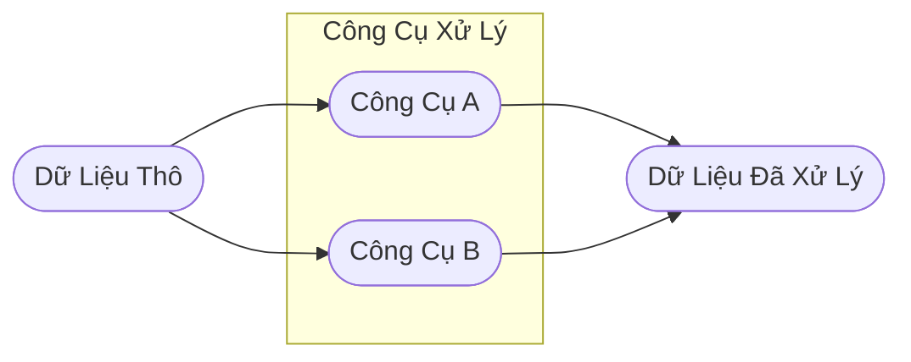

# citd-IE313

- IE313.F32.LT.CNTT - Phân Tích và Trực Quan Dữ Liệu - Phạm Thế Sơn

```mermaid
graph LR
nodea(["Dữ Liệu Thô"])
nodeb(["Dữ Liệu Đã Xử Lý"])

subgraph "Công Cụ Xử Lý"
 toola(["Công Cụ A"])
 toolb(["Công Cụ B"])
end

nodea --> toola & toolb --> nodeb
```

Dataset: https://archive.ics.uci.edu/
Dataset Type: Tabular (structured)
